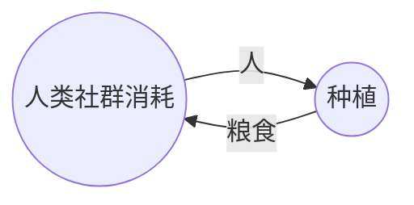
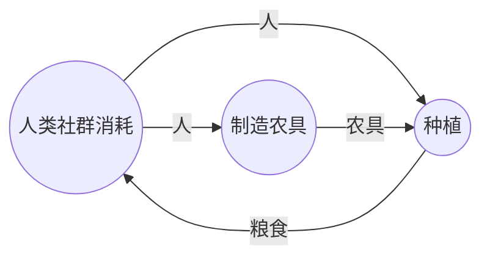
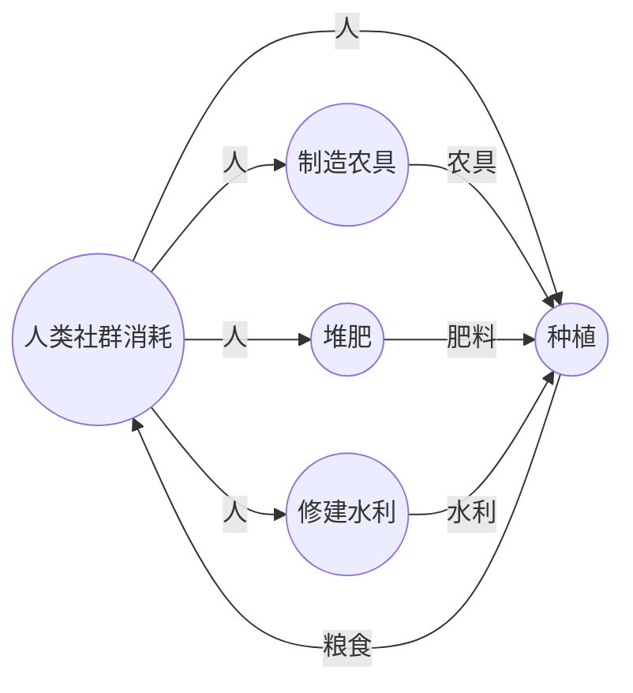
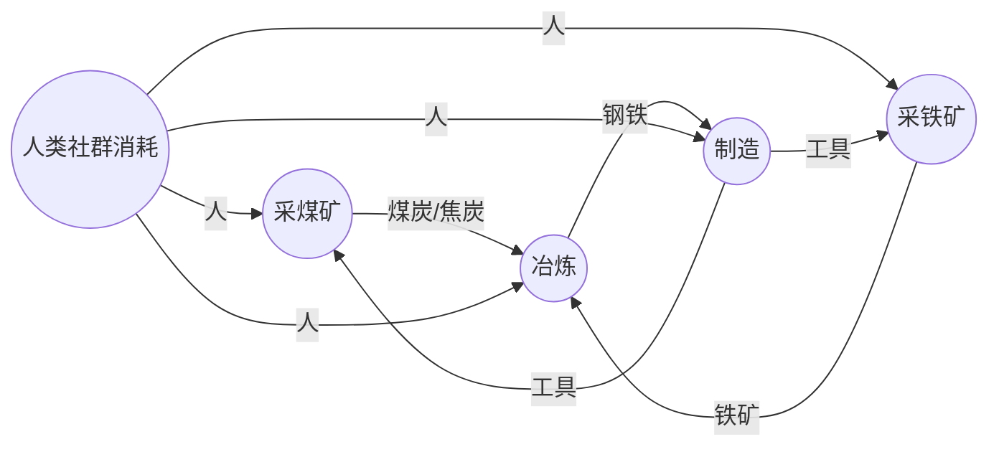
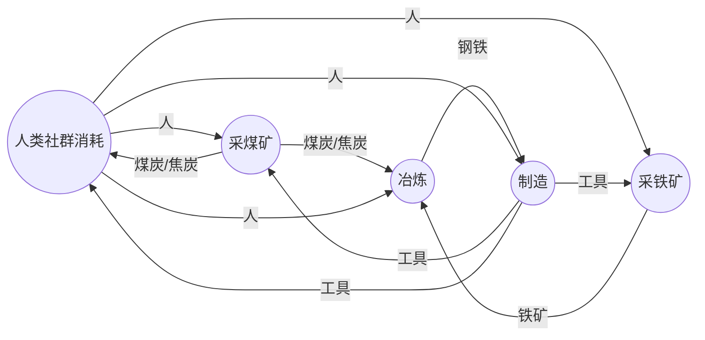
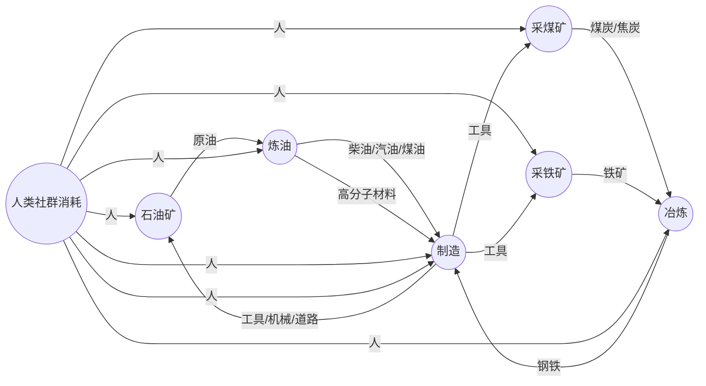
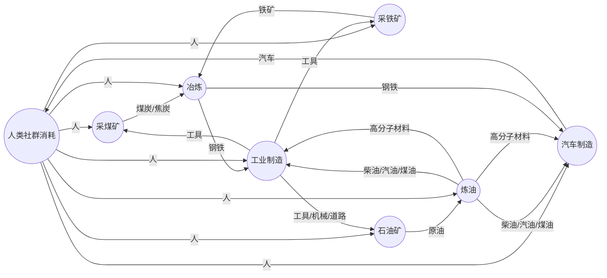
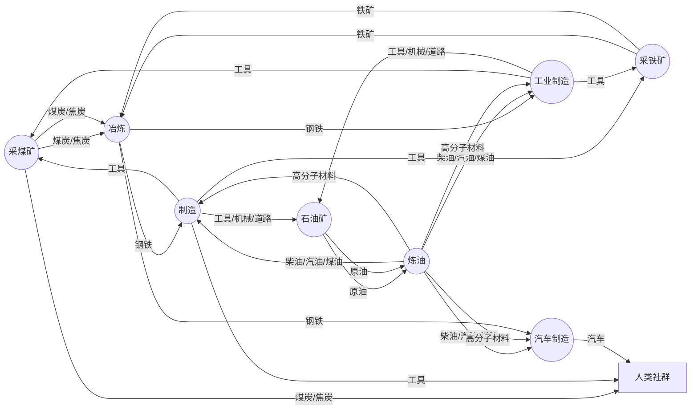

# 什么是生产力

生产力决定生产关系，生产关系反过来作用于生产力。这句耳熟能详的话是小时候就反复灌输的内容。那么什么是生产力呢？什么是生产关系呢？这两句话又对我们的社会有什么实际意义？

如果查定义，生产力是人们改造自然、征服自然的能力。这句话很正确，但无法解惑为什么农业社会和工业社会有如此大的差异。如果说工业有重工业的话，农业时代也有煤矿，还是好挖得多的露天煤矿，也有炼铁锻钢。很多穿越种田文，回到古代社会搞了些技术升级，好像就迈入了工业化门槛，生产力就飞速发展了？农业社会几千年也涌现了很多新技术，为什么生产力就没有这样飞速发展？要是能找到一个决定生产力的核心要素，我们花大力气推动它，是不是就能早一天迈入共产主义了？到时候对应就是一个人就能移山填海的生产力？这样的话或许修仙是个更快的途径。

温铁军教授曾这样来描述工业化：“工业化是一个资本增密的过程”。如果再补充一些细节，工业化的特点包括资本增密、技术增密、劳动挤出。但这并不能完美的解释工业化。农业也可以资本增密，比如千年前的牛耕铁器、新育种、水车普及等等，也符合这种描述，但和我们直觉中的工业化差距甚远。贵金属从铜到银、金是否也算资本增密？现代高科技芯片的不断进步，肯定算工业化了，但直接把芯片放到农田里，似乎并不比提供化肥更有效。最让我困惑的是，曾经的机械计算机设计无比精巧，可以做加减乘除，实在让人叹为观止，为什么没有在几百年前就引发信息技术革命呢？

要回答这些困惑，需要建立一个基础概念，就是什么叫生产。当然可以把生产定义为改造自然，但没有给出更多信息了。改造自然的目的是为了产出一些必需品供给人，要是本来就有大量的食物和舒适的环境，似乎就不需要改造自然了。那么可以这么定义，生产就是把自然环境转换成人所需物的过程。这种描述表现出方向性，就是自然环境资源通过生产的活动，变成人所需物，然后被人使用或消耗掉。如果自然存在的东西本来就是人所需的，比如干净的泉水，随处可见的果实，天然的洞穴，那么就无需这种生产过程，直接享受就好了。如果自然不包含这些东西，人就发挥聪明才智，通过特定的生产劳动，让现有的自然资源变成人所需的，例如打井取水、种地收粮、伐木建屋等。

## 产业循环：链式与环式

如果观察人类基础需求的生产过程，例如衣食住行，可以发现环式的生产过程。以最简单的种地为例，将人类社群作为1个集体，可输出专业人力即农民进行种植。将种植作为一个环节，那么种植的产出就是粮食，回到人类社群。那么就可建立1个最小的循环（见下图），即人类社群输出人力到种植活动，种植活动返回粮食到人类社群。

这个循环极度简化了种植的过程，实际上种植需要种子、肥料、水源、土地、工具等资源，这些资源需要从自然界中获取。对应的操作也增加了犁地、播种、浇水、施肥、收割等步骤。那么就可以建立更复杂的循环，但仍然只有1个环。针对种植，额外增加1个制造农具的环节，即人类社群输出人力到制造农具，制造农具返回农具到人类社群。那么就可以建立1个环，即人类社群输出人力到种植活动，种植活动返回粮食到人类社群，人类社群输出人力到制造农具，制造农具返回农具到人类社群。这个环式生产过程，就是人类文明的基础。

如果再增加堆肥、修建水利等环节，就可 建立更复杂的环式生产过程，形成如下的种植产业图。

可见虽然生产内容越来越复杂，但最核心的仍然是最初的种植生产循环，其他环节的产出都是辅助种植，对人类社群本身无用。

如果考察其他的生产过程，包括纺织、建房等，大多遵循相同的规律，即人类社群输出人力到生产活动，生产活动返回产出物到人类社群。这些环节的产出物，要么是直接供人类社群使用，要么是辅助其他环节，对人类社群本身无用。因此可以认为，人类社群的生产过程，都是环式生产过程。

考虑工业生产过程，也有类似的生产环。以工业革命初期的挖煤为例，人类社群输出人力到挖煤，挖煤输出煤炭。但输出的煤炭部分会用于人类社群的取暖，部分会作为燃料动力或者材料，用于其他生产环节，例如炼铁、炼钢，需要用到煤炭燃料和焦炭。进一步观察炼成的钢铁输出到制造业，生产出挖矿的工具，包括各种镐头、铲子以及蒸汽机作为动力源，则建立了采矿、冶炼、制造的循环，即人类社群输出人力到采矿，采矿输出煤炭，人类社群输出人力到冶炼，冶炼输出钢铁，人类社群输出人力到制造，制造输出工具，得到如下生产循环（如下图）。

这个生产循环可以再增加运输环节，整个生产循环的逻辑不变。这个循环与之前的循环不同：1. 人参与生产，但产出物并不直接返回到人类社群中，而是在这个产业循环中流转；2. 人在整个生产循环中仅起到操作和维护的作用，能量由煤炭提供，生产信息由制造出的机械工具固化。如果这个生产循环能消耗完其中所有的煤炭、钢铁，对人类社群没有任何反馈而是简单消耗人力，那么这个生产循环是负向的，对人类社群无益。但如果这个生产循环能产生更多的煤炭、钢铁，对人类社群有正向反馈，那么这个生产循环就是正向的，对人类社群有益。

进一步考察另一个类似的生产循环：石化产业。石化产业也包含原油采集、炼油，输出可作为能源的柴油、汽油、煤油，以及各种高分子材料，从沥青到乙烯。石化产业与采矿、冶炼、制造产业类似，也是人类社群输出人力到生产活动，生产活动产生的产出物可用于制造更多的工具、机械、道路等，但通常这个过程离不开钢铁以及其他有色金属行业，目前的石化生产循环并不孤立，而是和煤钢循环联合，其生产循环如下图。

其他现代化生产过程，和这些循环由或多或少的联系。比如生产轿车，要用到生产循环中的钢铁、塑料、橡胶、轮胎、玻璃、电子元件、发动机、轮胎、电池等，这些环节的产出物，通过面向人类社群需要的制造业，生产供人使用的汽车。这些汽车与之前参与工业生产循环的运输车辆不同，仅供人类多年使用就报废掉，是个耗散的过程，因此是从产业循环中延申出来的一根链，产物指向人类社会。

其他很多消费品的生产都与之类似，即从纯粹的工业生产循环中获取能源、材料，进而生产出供人类使用的消费品。这些消费品在人类社群中循环，消耗人力，但最终会报废掉，因此是耗散的过程，对工业生产循环是提取而非贡献。

另一种生产过程是服务业，服务业的产出物是服务，服务本身不是物质，而是人类社群的消耗。服务业的产出物，例如餐饮、旅游、娱乐、教育、医疗等，都是人类社群的消耗，但人类社群消耗这些服务后，不会产生任何物质，因此对人类社群也是耗散的过程。

还有一种生产过程在工业循环中，但仅仅起到辅助作用，并不在主循环中。

这里我们可以做个设想。假定未来技术水平极高，即很多生产环节并不需要人参与，或者人参与生产活动的时间大大缩短，那么人类社群的生产过程，就只剩下纯粹的环式生产过程。我们将上述图示中的人参与生产的箭头弱化，仅观察物质的流动，就可以看到如下的图景。

可见一个独立的生产循环，能量和物资在里面循环，像一个巨大的漩涡；其他的