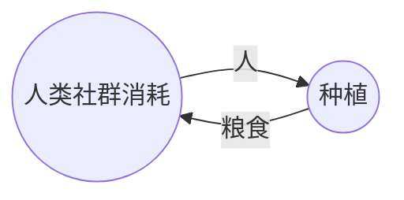

# 什么是生产力

生产力决定生产关系，生产关系反过来作用于生产力。这句耳熟能详的话是小时候就反复灌输的内容。那么什么是生产力呢？什么是生产关系呢？这两句话又对我们的社会有什么实际意义？

如果查定义，生产力是人们改造自然、征服自然的能力。这句话很正确，但无法解惑为什么农业社会和工业社会有如此大的差异。如果说工业有重工业的话，农业时代也有煤矿，还是好挖得多的露天煤矿，也有炼铁锻钢。很多穿越种田文，回到古代社会搞了些技术升级，好像就迈入了工业化门槛，生产力就飞速发展了？农业社会几千年也涌现了很多新技术，为什么生产力就没有这样飞速发展？要是能找到一个决定生产力的核心要素，我们花大力气推动它，是不是就能早一天迈入共产主义了？到时候对应就是一个人就能移山填海的生产力？这样的话或许修仙是个更快的途径。

温铁军教授曾这样来描述工业化：“工业化是一个资本增密的过程”。如果再补充一些细节，工业化的特点包括资本增密、技术增密、劳动挤出。但这并不能完美的解释工业化。农业也可以资本增密，比如千年前的牛耕铁器、新育种、水车普及等等，也符合这种描述，但和我们直觉中的工业化差距甚远。贵金属从铜到银、金是否也算资本增密？现代高科技芯片的不断进步，肯定算工业化了，但直接把芯片放到农田里，似乎并不比提供化肥更有效。最让我困惑的是，曾经的机械计算机设计无比精巧，可以做加减乘除，实在让人叹为观止，为什么没有在几百年前就引发信息技术革命呢？

要回答这些困惑，需要建立一个基础概念，就是什么叫生产。当然可以把生产定义为改造自然，但没有给出更多信息了。改造自然的目的是为了产出一些必需品供给人，要是本来就有大量的食物和舒适的环境，似乎就不需要改造自然了。那么可以这么定义，生产就是把自然环境转换成人所需物的过程。这种描述表现出方向性，就是自然环境资源通过生产的活动，变成人所需物，然后被人使用或消耗掉。如果自然存在的东西本来就是人所需的，比如干净的泉水，随处可见的果实，天然的洞穴，那么就无需这种生产过程，直接享受就好了。如果自然不包含这些东西，人就发挥聪明才智，通过特定的生产劳动，让现有的自然资源变成人所需的，例如打井取水、种地收粮、伐木建屋等。

## 产业循环：链式与环式

如果观察人类基础需求的生产过程，例如衣食住行，可以发现环式的生产过程。以最简单的种地为例，将

