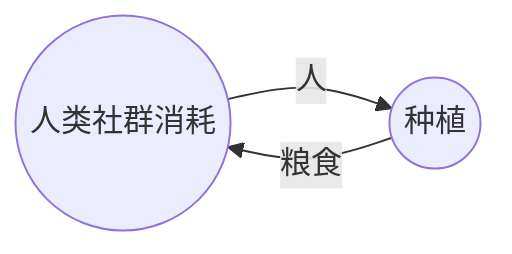
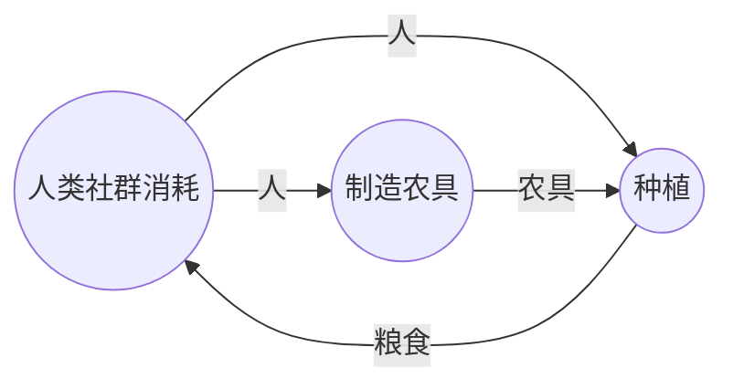
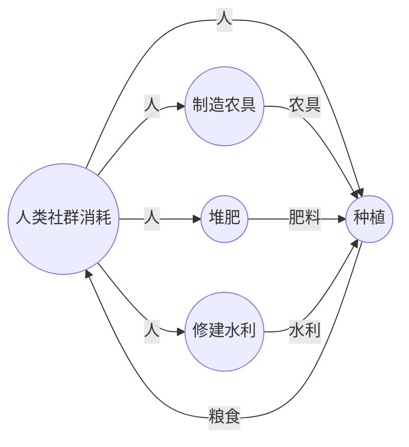
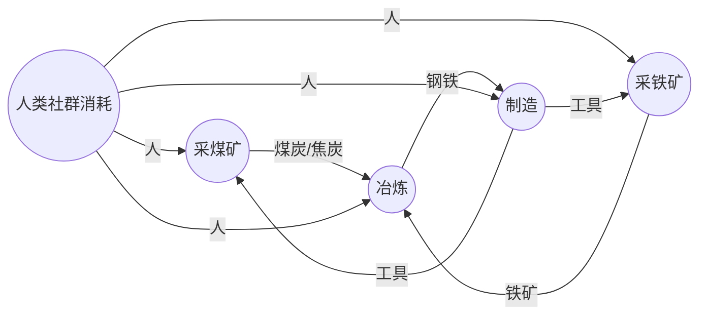
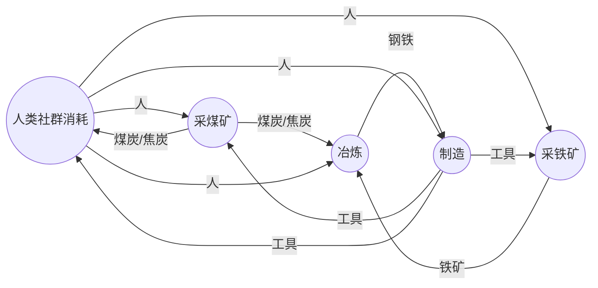
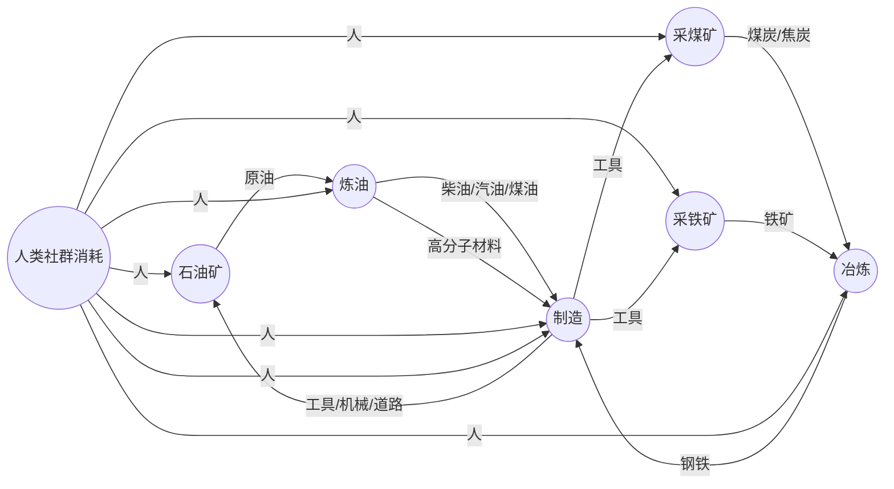
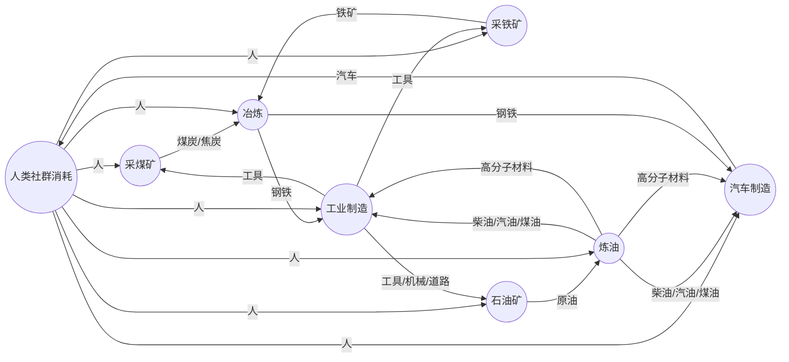
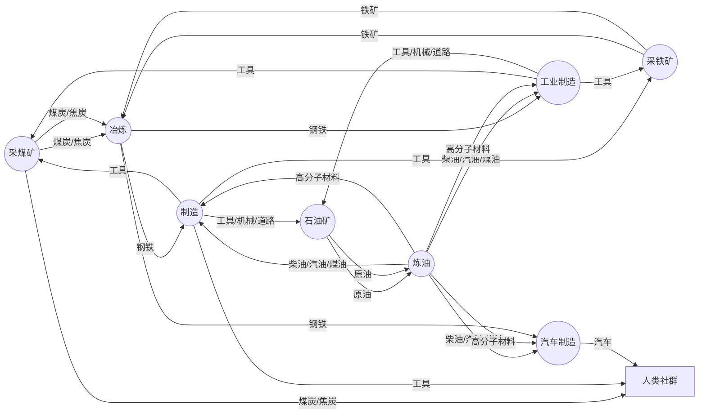

# 什么是生产力

生产力决定生产关系，生产关系反过来作用于生产力。这句耳熟能详的话是小时候就反复灌输的内容。那么什么是生产力呢？什么是生产关系呢？这两句话又对我们的社会有什么实际意义？

如果查定义，生产力是人们改造自然、征服自然的能力。这句话很正确，但无法解惑为什么农业社会和工业社会有如此大的差异。如果说工业有重工业的话，农业时代也有煤矿，还是好挖得多的露天煤矿，也有炼铁锻钢。很多穿越种田文，回到古代社会搞了些技术升级，好像就迈入了工业化门槛，生产力就飞速发展了？农业社会几千年也涌现了很多新技术，为什么生产力就没有这样飞速发展？要是能找到一个决定生产力的核心要素，我们花大力气推动它，是不是就能早一天迈入共产主义了？到时候对应就是一个人就能移山填海的生产力？这样的话或许修仙是个更快的途径。

温铁军教授曾这样来描述工业化：“工业化是一个资本增密的过程”。如果再补充一些细节，工业化的特点包括资本增密、技术增密、劳动挤出。但这并不能完美的解释工业化。农业也可以资本增密，比如千年前的牛耕铁器、新育种、水车普及等等，也符合这种描述，但和我们直觉中的工业化差距甚远。贵金属从铜到银、金是否也算资本增密？现代高科技芯片的不断进步，肯定算工业化了，但直接把芯片放到农田里，似乎并不比提供化肥更有效。最让我困惑的是，曾经的机械计算机设计无比精巧，可以做加减乘除，实在让人叹为观止，为什么没有在几百年前就引发信息技术革命呢？

要回答这些困惑，需要建立一个基础概念，就是什么叫生产。当然可以把生产定义为改造自然，但没有给出更多信息了。改造自然的目的是为了产出一些必需品供给人，要是本来就有大量的食物和舒适的环境，似乎就不需要改造自然了。那么可以这么定义，生产就是把自然环境转换成人所需物的过程。这种描述表现出方向性，就是自然环境资源通过生产的活动，变成人所需物，然后被人使用或消耗掉。如果自然存在的东西本来就是人所需的，比如干净的泉水，随处可见的果实，天然的洞穴，那么就无需这种生产过程，直接享受就好了。如果自然不包含这些东西，人就发挥聪明才智，通过特定的生产劳动，让现有的自然资源变成人所需的，例如打井取水、种地收粮、伐木建屋等。

## 产业循环：链式与环式

### 农业时代的环式
如果观察人类基础需求的生产过程，例如衣食住行，可以发现环式的生产过程。以最简单的种地为例，将人类社群作为1个集体，可输出专业人力即农民进行种植。将种植作为一个环节，那么种植的产出就是粮食，回到人类社群。那么就可建立1个最小的循环（见下图），即人类社群输出人力到种植活动，种植活动返回粮食到人类社群。

这个循环极度简化了种植的过程，实际上种植需要种子、肥料、水源、土地、工具等资源，这些资源需要从自然界中获取。对应的操作也增加了犁地、播种、浇水、施肥、收割等步骤。那么就可以建立更复杂的循环，但仍然只有1个环。针对种植，额外增加1个制造农具的环节，即人类社群输出人力到制造农具，制造农具返回农具到人类社群。那么就可以建立1个环，即人类社群输出人力到种植活动，种植活动返回粮食到人类社群，人类社群输出人力到制造农具，制造农具返回农具到人类社群。这个环式生产过程，就是人类文明的基础。

如果再增加堆肥、修建水利等环节，就可 建立更复杂的环式生产过程，形成如下的种植产业图。

可见虽然生产内容越来越复杂，但最核心的仍然是最初的种植生产循环，其他环节的产出都是辅助种植，对人类社群本身无用。

如果考察其他的生产过程，包括纺织、建房等，大多遵循相同的规律，即人类社群输出人力到生产活动，生产活动返回产出物到人类社群。这些环节的产出物，要么是直接供人类社群使用，要么是辅助其他环节，对人类社群本身无用。因此可以认为，人类社群的生产过程，都是环式生产过程。

### 工业时代的生产循环

考虑工业生产过程，也有类似的生产环。以工业革命初期的挖煤为例，人类社群输出人力到挖煤，挖煤输出煤炭。但输出的煤炭部分会用于人类社群的取暖，部分会作为燃料动力或者材料，用于其他生产环节，例如炼铁、炼钢，需要用到煤炭燃料和焦炭。进一步观察炼成的钢铁输出到制造业，生产出挖矿的工具，包括各种镐头、铲子以及蒸汽机作为动力源，则建立了采矿、冶炼、制造的循环，即人类社群输出人力到采矿，采矿输出煤炭，人类社群输出人力到冶炼，冶炼输出钢铁，人类社群输出人力到制造，制造输出工具，得到如下生产循环（如下图）。

这个生产循环可以再增加运输环节，整个生产循环的逻辑不变。这个循环与之前的循环不同：1. 人参与生产，但产出物并不直接返回到人类社群中，而是在这个产业循环中流转；2. 人在整个生产循环中仅起到操作和维护的作用，能量由煤炭提供，生产信息由制造出的机械工具固化。如果这个生产循环能消耗完其中所有的煤炭、钢铁，对人类社群没有任何反馈而是简单消耗人力，那么这个生产循环是负向的，对人类社群无益。但如果这个生产循环能产生更多的煤炭、钢铁，对人类社群有正向反馈，那么这个生产循环就是正向的，对人类社群有益。

进一步考察另一个类似的生产循环：石化产业。石化产业也包含原油采集、炼油，输出可作为能源的柴油、汽油、煤油，以及各种高分子材料，从沥青到乙烯。石化产业与采矿、冶炼、制造产业类似，也是人类社群输出人力到生产活动，生产活动产生的产出物可用于制造更多的工具、机械、道路等，但通常这个过程离不开钢铁以及其他有色金属行业，目前的石化生产循环并不孤立，而是和煤钢循环联合，其生产循环如下图。

其他现代化生产过程，和这些循环由或多或少的联系。比如生产轿车，要用到生产循环中的钢铁、塑料、橡胶、轮胎、玻璃、电子元件、发动机、轮胎、电池等，这些环节的产出物，通过面向人类社群需要的制造业，生产供人使用的汽车。这些汽车与之前参与工业生产循环的运输车辆不同，仅供人类多年使用就报废掉，是个耗散的过程，因此是从产业循环中延申出来的一根链，产物指向人类社会。

其他很多消费品的生产都与之类似，即从纯粹的工业生产循环中获取能源、材料，进而生产出供人类使用的消费品。这些消费品在人类社群中循环，消耗人力，但最终会报废掉，因此是耗散的过程，对工业生产循环是提取而非贡献。

另一种生产过程是服务业，服务业的产出物是服务，服务本身不是物质，而是人类社群的消耗。服务业的产出物，例如餐饮、旅游、娱乐、教育、医疗等，都是人类社群的消耗，但人类社群消耗这些服务后，不会产生任何物质，因此对人类社群也是耗散的过程。

还有一种生产过程在工业循环中，但仅仅起到辅助作用，并不在主循环中。

这里我们可以做个设想。假定未来技术水平极高，即很多生产环节并不需要人参与，或者人参与生产活动的时间大大缩短，那么人类社群的生产过程，就只剩下纯粹的环式生产过程。我们将上述图示中的人参与生产的箭头弱化，仅观察物质的流动，就可以看到如下的图景。

可见一个独立的生产循环，能量和物资在里面循环，像一个巨大的漩涡；其他的都是补充拓宽这个漩涡，或者是漩涡的延伸。这个产业循环是正循环，越是技术进步，输出的能量和材料就越多，其他的生产过程都是耗散性，将溢出的能量和材料通过某种形式耗散掉。

因此，一个独立的生产循环，如果其产出物能返回到这个循环中，那么这个循环就是正向的，对人类社群有益；如果其产出物不能返回到这个循环中，那么这个循环就是耗散的。
为了佐证这个观点，接下来考察更多种类的生产过程，评估与生产循环的关系。

## 生产循环的产出

# 其他产业过程

这个模型是简化的，现实中有很多种类的生产过程，但它们都遵循这个规律：如果生产过程产生的产出物能返回到这个生产循环中，那么这个生产过程就是正向的，能溢出相应的能源、材料；如果生产过程产生的产出物不能返回到这个生产循环中，那么这个生产过程就是单纯的耗散，将其他生产循环中溢出的产品消耗掉。接下来从更多典型的生产过程来考察这一模型的可信度。

## 信息技术

信息技术是第三次工业革命的标识性成就之一，从最初的数字电路、计算机逐步发展出互联网，以及今年来蓬勃发展的大数据、云计算、区块链、人工智能等一系列技术革命，都在深刻的重塑我们的社会。信息技术的生产过程是怎样的呢？粗略的分类可以分为硬件和软件两个层面，硬件包括芯片、计算机、服务器、计算集群、网络设施等，软件包括编程理论、操作系统、数据库、开发工具以及各类应用生态。
早期的数字电路主要用于进行电控，即人将生产信息固化到电路中，实现生产过程的部分自动化。此时就出现了数字电路设计和编码。后续随着信息技术不断突破，信息技术始终都在用于固化特定的生产流程，从而实现生产过程的自动化。信息技术越先进，固化处理的信息复杂度就越高，固化相同信息的成本就越低，以至于现代相当多人认定软件传播的边际成本为零。
因此信息技术发展仍然在正生产循环中，属于内部制造业的一个分支，既包含硬件建设，也包含软件构建，其产出物是工具，可降低生产循环的信息流转成本。

## 电力系统

电力系统是第二次工业革命的标志性成就。在电力系统出现之前，工业 生产过程主要依靠蒸汽机、水力机等动力设备，这些动力设备需要消耗煤炭、石油等能源。以电作为能源的形态，使得能量的载体由煤炭、原油等化学能转变为电磁场驱动电子，能源的形态更为纯粹，与物质形态剥离开，能量传递效率更高。当电力出现后，就开始大面积取代蒸汽机动力，使得工厂工人摆脱了煤粉污染、大量的机械传动机构等不利因素，大幅提高了生产效率。

电力系统的输入越来越多样化，包含化学能（煤炭、石油、氢能以及电池等）、机械能（水力、风力、潮汐）、光能（光伏）、核能、热能（地热发电）等，生产过程的形态上包含发电、变电、输电、用电等不同阶段，其产出物是电能，可降低生产循环的能量传递成本。

畅想潜在的能源发展趋势，未来能源形态进一步纯粹化，则载体将变为光子，可融入的能量类型可拓展核能、正反物质湮灭能等。

## 交通系统

交通系统自古有之，且 与生产循环关系密切。从古至今，人类一直在寻找更高效的交通方式，从马车、火车、汽车、飞机、高铁、磁悬浮、火箭等，每一次技术突破，都大幅提高了人类社会的生产效率。现代交通系统，其产出物是工具，可降低生产循环的运输成本。但需要区分的是，交通系统本身是耗散性过程，既参与生产循环，也参与耗散性生产过程，也参与人类社群的纯耗散过程。这三类应用很难精确的区分。
无法简单说1个人开车出门或者乘坐高铁飞机到底属于哪类生产过程。

交通系统对生产循环的贡献，是支撑不可或缺的物资流动。其意义一方面是降低物资运输损耗，一方面是降低物资运输成本。

## 金融服务

金融服务是现代社会的重要生产组织工具，其衍生的意义远远超过了物品交换的功用，对社会文化的塑造、生产效率的提升、生产循环的规模都有深远影响。金融服务本身是耗散性过程，但参与生产循环。由于金融服务通常并不产生实体产品，因此很难将其归类为正向生产循环。但金融服务的存在，使得生产循环的规模得以扩大，生产循环的效率得以提升，生产循环的风险得以分散。

然而从积极角度看金融服务可通过金融工具分散生产循环的风险，集中社会资源，提高生产循环的效率，但私人金融服务的目标往往是资本增殖，而私人资本主要还是更关注以货币为度量的资本增殖，而非社会资源的最大化利用。这就会导致一个奇特的结果，即金融本身就能通过构建信息闭环实现货币增殖闭环，无论是政府的量化宽松还是私人资本炒作大宗物资期货，都可以虚空创造出货币价值，而与实际的生产循环无关。（原油价格负值事件、比特币价格泡沫事件、房地产泡沫事件、锂矿争端等）这种情况下金融服务丧失了优化生产循环的功能，而是集中在人类社群的资源再分配上，这时金融服务就是纯耗散性过程，而再分配的力度又比不上权力强制征收和武装掠夺。

不能服务生产循环的金融只会成为权力乃至暴力的附庸。

## 技术创新

技术创新是推动生产循环向前发展的关键因素，它包括科学发现、技术发明、技术创新等。技术创新可以提高生产效率，降低生产成本，从而推动生产循环的规模扩大。技术创新本身是正向生产循环的一部分，因为它可以产生新的工具、新的方法，从而提高生产循环的效率。但在生产循环中，却很难直接给技术创新划出一个流程或者位置。技术创新也存在一定偶然性，其规律和确定性的生产过程不同，因此技术创新的产出物往往是不确定的，有时候是负向的，有时候是正向的。

这里我们尝试做个描述。[ToDo]
技术创新
[这里没太想好，技术创新的注入形式应该是生产循环内要素的重组优化，但这个过程是针对生产活动内部的，并不直接体现在生产循环本身的结构上。待第二章中数学描述构建完成后再来更新。]

## 文化娱乐产业

文化娱乐产业是纯粹的耗散性过程。文化娱乐产业是将生产循环中溢出的产能，移植一部分在人类非生理性需求中耗散掉。这个与科研创新的差异在于，文化娱乐产业的对象是人类社群自身，而非生产过程。

## 小结

综上，我们考察了很多领域与生产循环的关系，这个生产循环是真实存在的，那么它的具体形态和组成是什么？如何知道生产循环的规模？那需要进一步详细的分析了。
