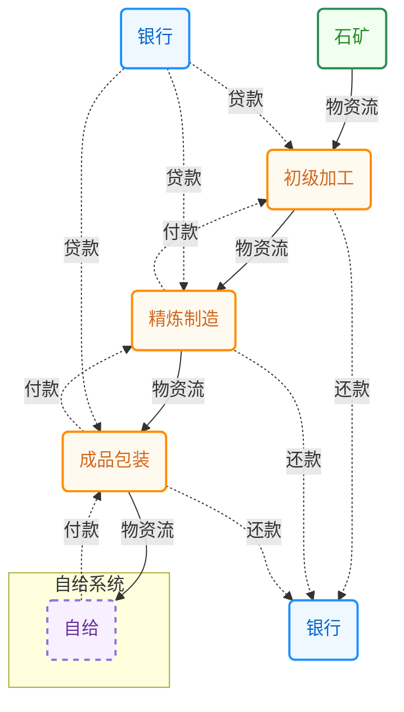

# 生产循环的发展过程

生产循环目前不能脱离人运转，其发展和萎缩也离不开人的干预。

# 生产链条拓展

生产链条的

# 生产循环拓展

# 货币的作用

货币在生产循环中起到的作用很特殊。
XXX教授提出市场经济比计划经济的优越性就在于信息维度低，交易成本显著降低。
货币也起到类似的作用。
对于每个生产过程，需要不同的、大量的生产资料，如果有有一个维度可以降低决策复杂度，显然对于提高生产的决策效率是非常有帮助的。
货币的作用就是把不同的生产资料进行统一的度量，形成一个共同的标准，也降低了信息的维度。
这样做有利有弊，因为降维会丢失部分信息，导致决策结果并不一定是最优，但快速高效的决策可提高生产过程效率。
显然在一定规模范围内，采用更全的信息决策，能获得全局最优，因此在绝大多数企业内并不采用单一的绩效管理模式，也不采用成本/盈利衡量所有部门。达到一定规模后，整个社会的运行如果要求过多的信息维度，会导致信息过载，导致社会运行效率降低。将大量的交易过程压缩为货币交易，可显著提高运行效率。

当然这个结论的前提是进行全维度的交易难度显著高于货币交易，如果在市场有极为高效的配置能力，那么货币的作用就不那么明显了。

## 货币的流动

现代货币是通过银行贷款放出的。对于1个生产链条而言，银行和货币在生产过程中扮演了重要的角色。在最开始生产时银行会向生产端放贷，生产进入正轨后，企业等生产单位向银行还贷款。过程如下图所示：

银行起到的是水龙头作用，控制生产链路中的环节。
各行业贷款利率、最贷额度、贷款周期就是水龙头的阀门．是几次的？一次、二次还是三次？
最终消费者是哪里来的？

①生产链路的发端；

②参与劳动的人；

③转移支付（白给到人）；

错配：

①银行为保证盈利，不是按交易和扩产需求来提供流动性，面是根据偿还能力评估，即根据风险／收益模型评估，此时银行放贷功能错位，需通过其他融资手段来获取资金投资。这种更关心资金效率。

②同时有在生产关系中可以获得重大资金流入的部分，脱离为了贷软游戏，甚至可以自己放货或会融投机获利。
